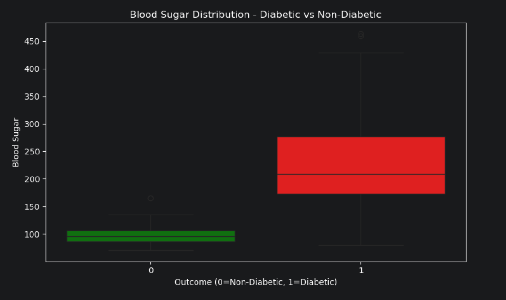
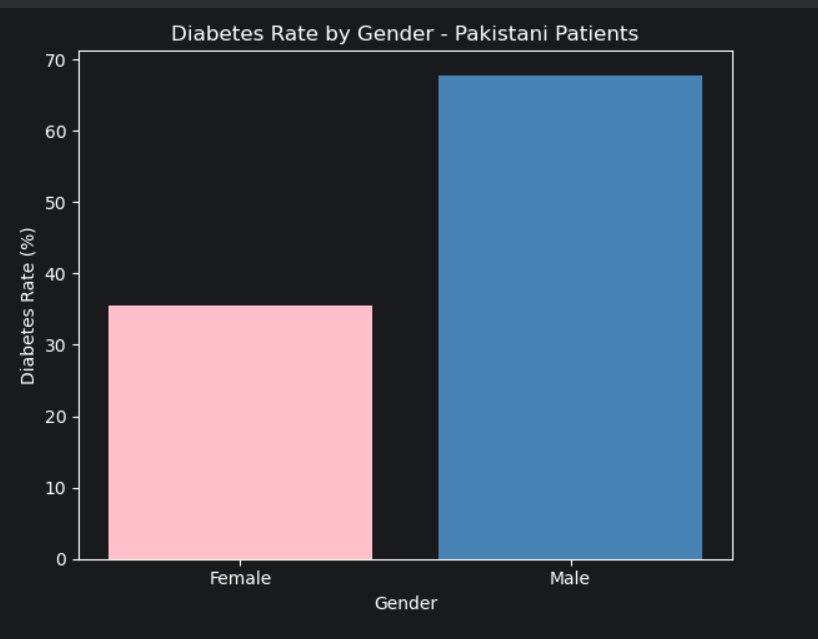

# 🩺 Pakistani Diabetes Data Analysis

## 📌 Project Overview
Analysis of 912 Pakistani diabetes patients to identify 
key risk factors using Python, Pandas, and Seaborn.

## 🔍 Key Findings
- Age 40+ males at highest risk
- Blood Sugar & A1c strongest predictors  
- Senior patients (60+) — 100% diabetic

## 📊 Visualizations

## 🛠️ Tools Used
Python | Pandas | NumPy | Matplotlib | Seaborn

## 📁 Dataset
912 Pakistani patient records
